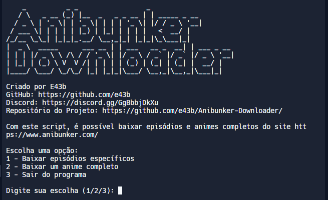
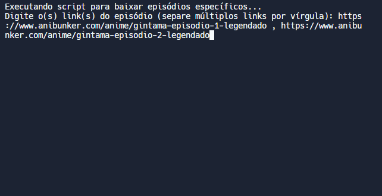
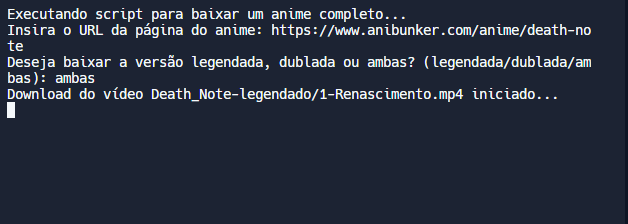
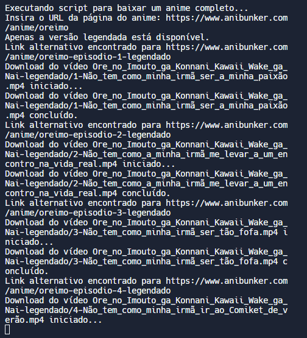
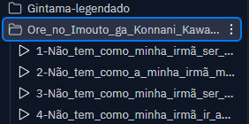

# Anibunker-Downloader   [](https://github.com/e43b/Anibunker-Downloader/)

[Discord](https://discord.gg/GgBbbjDkXu)

O **Anibunker Downloader** é uma ferramenta desenvolvida para facilitar o download de episódios e animes completos do site [Anibunker](https://www.anibunker.com/). Este projeto foi criado com o objetivo de proporcionar uma maneira simples e eficiente de acessar e salvar conteúdos de anime para visualização offline.

## Funcionalidades

- **Download de Episódios Específicos:** Permite baixar episódios específicos de animes ao inserir os links correspondentes.
  
- **Download Completo de Animes:** Oferece a opção de baixar todos os episódios de um anime, verificando automaticamente a disponibilidade das versões legendada e dublada.

- **Organização Automática:** Os vídeos são salvos em pastas separadas para cada versão (legendada e dublada), facilitando a gestão e organização dos arquivos baixados.

## Como Usar

1. **Instalação:**
   - Certifique-se de ter Python instalado em seu sistema.
   - Clone este repositório:
     ```
     git clone https://github.com/e43b/Anibunker-Downloader.git
     ```
   - Navegue até o diretório do projeto:
     ```
     cd Anibunker-Downloader
     ```

2. **Execução:**
   - Execute o script principal:
     ```
     python menu.py
     ```
   - Siga as instruções no menu para escolher entre baixar episódios específicos ou um anime completo.

## Bibliotecas

As bibliotecas necessárias são:
     ```
     requests &
     beautifulsoup4
     ```
Ao iniciar o script pela primeira vez, se as bibliotecas não estiverem instaladas, será solicitado para instalá-las. Basta digitar "s" e elas serão instaladas automaticamente.


## Página Inicial

A página inicial do projeto apresenta as principais opções disponíveis para facilitar o download de animes.



## Baixar Episódios

Para baixar episódios específicos, basta inserir o link do episódio. Se desejar baixar vários episódios, separe os links por vírgula. Exemplo:
     ```
     https://www.anibunker.com/anime/oreimo-episodio-1-legendado , https://www.anibunker.com/anime/gintama-episodio-8-legendado , https://www.anibunker.com/anime/death-note-episodio-7-dublado
     ```



## Baixar Todos os Episódios de um Anime

Insira o link do anime e o script verificará se há uma versão dublada disponível. Você terá a opção de baixar a versão dublada, legendada ou ambas as versões. Se o anime tiver apenas a versão legendada ou dublada, o download será iniciado automaticamente.




## Organização dos Arquivos

Os vídeos são salvos em pastas para facilitar a organização. É criada uma pasta para os episódios do anime legendado e outra para os episódios do anime dublado.




## Contribuições

Este projeto é de código aberto e você é encorajado a contribuir para melhorias e novas funcionalidades. Sinta-se à vontade para enviar sugestões, relatar problemas ou enviar pull requests através do [repositório oficial no GitHub](https://github.com/e43b/Anibunker-Downloader/).

## Autor

Desenvolvido e mantido por [E43b](https://github.com/e43b), o Anibunker Downloader visa simplificar o processo de download de animes, proporcionando uma experiência mais acessível e organizada para os fãs de anime.

## Links

- Repositório do Projeto: [https://github.com/e43b/Anibunker-Downloader/](https://github.com/e43b/Anibunker-Downloader/)
- Site Anibunker: [https://www.anibunker.com/](https://www.anibunker.com/)

